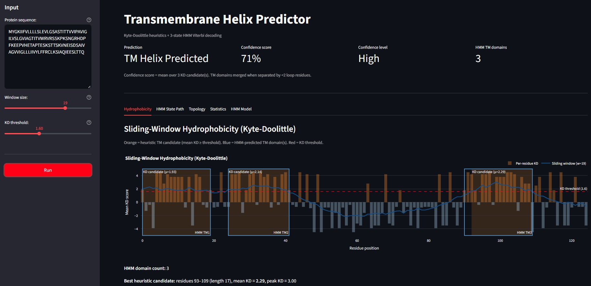
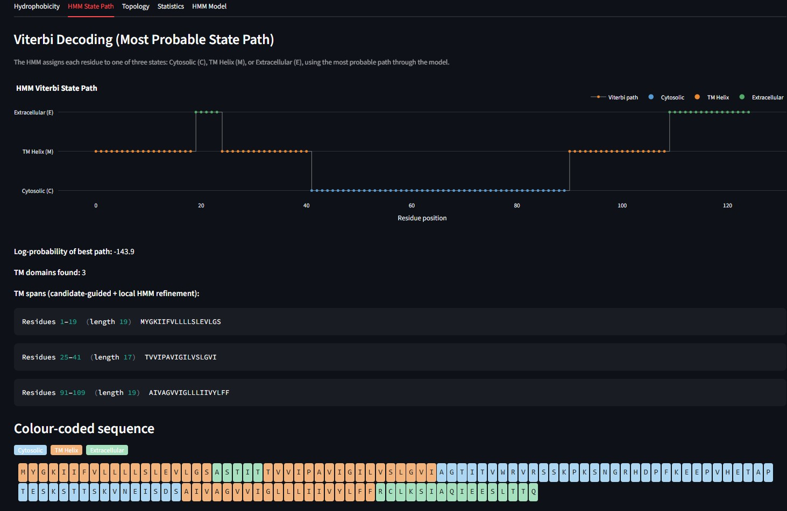
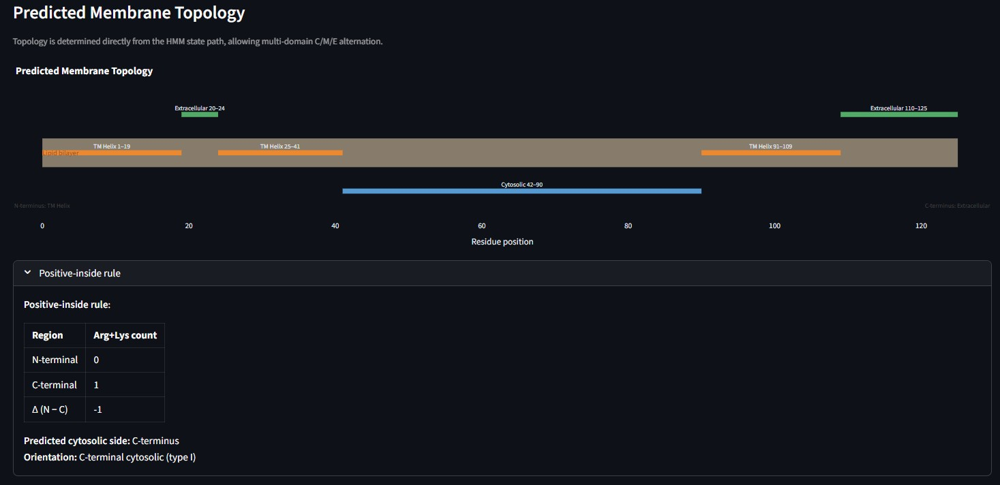
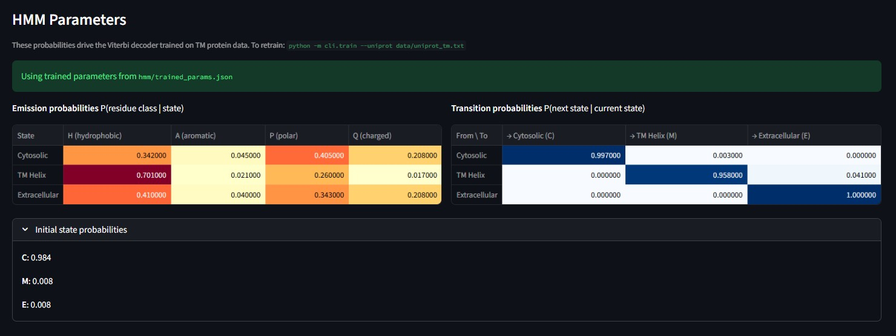
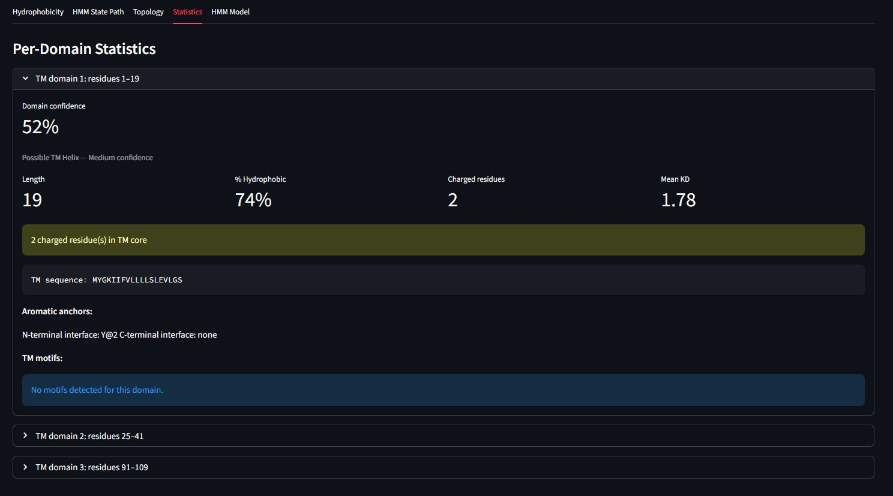

# Transmembrane Helix Predictor (TM HMM)

This tool predicts transmembrane (TM) helices and membrane topology from protein sequences, combining:

- **Kyte-Doolittle sliding-window hydrophobicity** for TM candidate detection 
- **Biological heuristics** including the positive-inside rule, aromatic interface anchors, and TM composition checks
- **Modular TM motif detection** (e.g. `G/AXXXG/A`, `S/TXXXS/T`)
- **3-state Hidden Markov Model (HMM)** with Viterbi decoding for Cytosolic / TM / Extracellular assignment
- **Candidate-guided multi-domain refinement** for proteins with repeated TM segments, merged with global HMM spans
- **Interpretable heuristic confidence scoring** with factor breakdown (HMM path score is shown separately)
- **Interactive Streamlit UI** for prediction, evidence, and model inspection
- **UniProt-supervised HMM training** from `FT TRANSMEM` annotations

## Biology/Chemistry Background

### What does this tool do?

Membrane proteins span the lipid bilayer through one or more hydrophobic transmembrane $\alpha$-helices, connected by loops on the cytosolic and extracellular sides. Predicting where these helices lie, and which side of the membrane each loop faces, is essential for understanding function and trafficking.

This predictor uses a two-stage approach:

1. **Heuristic screening** identifies hydrophobic stretches likely to span the membrane, then scores biological plausibility (charge asymmetry, composition, motifs).
2. **HMM decoding** assigns each residue to a hidden topological state (Cytosolic, TM helix, or Extracellular) using emission and transition probabilities, optionally trained on annotated UniProt sequences.

For **multi-pass** proteins (several TM domains in one chain), KD peaks are detected independently; each candidate is refined with a **local HMM window** and then merged with global HMM-detected domains into an alternating topology such as:

$$\text{C} \rightarrow \text{M} \rightarrow \text{E} \rightarrow \text{M} \rightarrow \text{C} \rightarrow \cdots$$

### Key Concepts

- **Hydrophobicity and the bilayer**: TM helices are enriched in hydrophobic residues that partition into the lipid core. The Kyte-Doolittle (KD) scale quantifies this propensity (Kyte & Doolittle, 1982).
- **Sliding-window TM prediction**: A window of mean KD score above ~1.6 for ~17–25 residues is a classical signal for a TM segment.
- **Positive-inside rule**: Arg and Lys are enriched on the cytosolic flank of TM helices, helping infer orientation (type I vs type II topology) (von Heijne, 1986).
- **Aromatic anchors / tryptophan belt**: Trp, Tyr, and Phe often sit at the membrane–water interface, stabilising helix placement (Yau et al., 1998).
- **TM motifs**: Short sequence patterns (e.g. glycine/alanine-rich motifs) can support helix–helix packing in the membrane.
- **Hidden Markov Models**: A compact probabilistic model over hidden states (topology) and observed emissions (amino acid classes), decoded with the Viterbi algorithm, conceptually related to TMHMM-style predictors (Krogh et al., 2001).
- **Heuristic confidence**: The reported confidence score is based on KD and biological heuristics only; HMM log-probability is displayed separately and is not currently folded into the confidence score.
- **Multi-domain proteins**: Repeated hydrophobic segments separated by aqueous loops correspond to multiple TM domains; adjacent spans separated by fewer than 2 residues are merged into one domain.

## Mathematics

### Kyte-Doolittle Sliding Window

For sequence length $n$, residue KD scores $h_i$, and odd window size $w$ with half-width $k = \lfloor w/2 \rfloor$, the smoothed score at position $i$ is:

$$\bar{h}_i = \frac{1}{e_i - s_i + 1} \sum_{j=s_i}^{e_i} h_j$$

where $s_i = \max(0,\, i-k)$ and $e_i = \min(n-1,\, i+k)$ (truncated windows at termini).

A **TM candidate** is a contiguous run where $\bar{h}_i \geq \tau$ (default $\tau = 1.6$), with length $\geq 17$ residues. Candidates are ranked by mean KD within the run. The confidence score is computed over KD candidates using heuristic factors, not from HMM path likelihood.

### Confidence Score

The overall confidence $S \in [0, 1]$ is a **transparent sum of weighted factors** (capped at 1.0). Each factor is reported in the Statistics tab.

| Factor | Condition | Contribution |
|--------|-----------|--------------|
| 1. Hydrophobic stretch | Best KD candidate present | $\min\left(\max\left(\dfrac{\mu_{\text{KD}} - 1.6}{2.0},\, 0\right),\, 0.45\right)$ |
| 2. Length adequacy | Best candidate length $\geq 17$ | $+0.10$ |
| 3. Composition OK | $\geq 50\%$ hydrophobic and 0 charged in TM core | $+0.10$ |
| 4. Positive-inside rule | $\|\Delta\| > 0$ for Arg/Lys flanks | $+0.15$ |
| 5. Aromatic belt | $\geq 1$ aromatic at interfaces | $+0.10$ |
| 6. Tryptophan anchor | $\geq 1$ Trp at interfaces | $+0.05$ |
| 7. No charged core | 0 charged residues in TM segment | $+0.05$ |
| 8. TM motifs | At least one motif hit in TM region | $+ \min\left(0.10,\ 0.05 + 0.02 \cdot (\text{hits} - 1)\right)$ |

**Classification thresholds** (after $S = \min(S, 1)$):

- $S \geq 0.65$ → **TM Helix Predicted** (High)
- $0.40 \leq S < 0.65$ → **Possible TM Helix** (Medium)
- $S < 0.40$ → **No TM Helix Detected** (Low)

*Global confidence uses the mean per-domain scores across all candidates; per-domain composition, aromatics, and motifs are shown separately in the Statistics tab.*

### HMM and Viterbi Decoding

The model has hidden states $S = \{\text{C}, \text{M}, \text{E}\}$ and emission alphabet $\mathcal{A} = \{\text{H}, \text{A}, \text{P}, \text{Q}\}$ (hydrophobic, aromatic, polar, charged residue classes).

**Parameters:**

- Initial: $\pi_s = P(q_1 = s)$
- Transition: $a_{s,s'} = P(q_t = s' \mid q_{t-1} = s)$
- Emission: $b_s(c) = P(o_t = c \mid q_t = s)$

All computations use **log-probabilities** $\log p$ with a small floor ($10^{-12}$) to avoid underflow.

**Viterbi recurrence** for observation sequence $o_1,\ldots,o_n$:

$$\delta_1(s) = \log \pi_s + \log b_s(o_1)$$

$$\delta_t(s) = \log b_s(o_t) + \max_{s'} \left[ \delta_{t-1}(s') + \log a_{s',s} \right]$$

The best path is recovered by traceback from $\arg\max_s \delta_n(s)$. Contiguous $\text{M}$ runs define TM spans; spans with intervening loop length $< 2$ are merged.

**Expected TM helix length** from the default self-loop $a_{M,M} = 0.95$:

$$\mathbb{E}[\text{length}] = \frac{1}{1 - a_{M,M}} = 20 \text{ residues}$$

(geometric distribution).

### Multi-Domain Reconstruction

1. Run full-sequence Viterbi → baseline path and spans.
2. For each KD candidate, extract window $[\text{start} - f,\, \text{end} + f]$ (default flank $f = 10$), run local Viterbi, and keep the TM span with maximum overlap to the candidate (fallback: KD span).
3. Merge local candidate-guided spans with global HMM spans, preserving HMM-only domains that were not detected by KD.
4. Merge spans with loop gap $< 2$.
5. Build **display path** via `build_alternating_path`: assign $\text{M}$ on each span; flip aqueous state C ↔ E after each crossing.

## Model Aspects

### HMM States

| State | Label | Biological role |
|-------|--------|-----------------|
| **C** | Cytosolic | Intracellular aqueous loop / N- or C-terminal tail on cytosolic side |
| **M** | TM helix | Hydrophobic segment spanning the lipid bilayer |
| **E** | Extracellular | Extracellular aqueous loop / lumen-facing tail |

Typical **single-pass** topology: $\text{C} \cdots \text{C} \rightarrow \text{M} \cdots \text{M} \rightarrow \text{E} \cdots \text{E}$ (or the reverse orientation).

**Multi-pass** topology alternates aqueous sides between TM domains, e.g. $\text{C} \rightarrow \text{M} \rightarrow \text{E} \rightarrow \text{M} \rightarrow \text{C}$.

### Emission Classes (H, A, P, Q)

The 20 amino acids are collapsed to four classes (`data/residues.py`) to keep emission tables interpretable:

| Class | Residues (examples) | Role |
|-------|---------------------|------|
| **H** | I, L, V, F, A, M | Hydrophobic — dominate TM core |
| **A** | W, Y | Aromatic — interface preference |
| **P** | S, T, N, Q, G, C | Polar — aqueous loops |
| **Q** | R, K, D, E, H | Charged — mostly excluded from TM core |

Default emissions strongly favour **H** in state **M** ($P(\text{H} \mid \text{M}) \approx 0.75$) and **P/Q** in **C** and **E**.

### Default Transition Structure

- **C → M** and **E → M**: entry into membrane
- **M → C** / **M → E**: exit to aqueous sides
- **C ↔ E** direct transitions: disallowed (0 probability) — crossings must go through **M**
- High self-loops on **C**, **E**, and especially **M** (long helices)

### TM Motifs (`core/motifs.py`)

Motifs are registered in `MOTIF_LIBRARY` and matched inside each TM segment:

| Pattern | Meaning |
|---------|---------|
| `G/AXXXG/A` | Gly or Ala at positions 1 and 5; any residue at 2–4 |
| `S/TXXXS/T` | Ser or Thr at positions 1 and 5 |
| `GXXXXXXG` | Long glycine repeat motif |

Syntax: **`X`** = wildcard; **`A/B`** = allowed alternatives at one position.

New motifs added by extending `MOTIF_LIBRARY`.

### UniProt Training

Training uses **supervised counting** on sequences with `FT TRANSMEM` features in UniProt flatfile (`.txt`) format:

```
FT   TRANSMEM        23..43
```

For each entry, the parser builds a per-residue label sequence under a **single-pass** assumption:

- residues before TM → **C**
- TM segment → **M**
- residues after TM → **E**

Counts are accumulated for:

- initial state $q_1$
- transitions $q_t \rightarrow q_{t+1}$
- emissions (residue class given state)

**Laplace smoothing** with pseudocount $\alpha = 0.1$ is applied before normalisation. Parameters are saved to `hmm/trained_params.json` and loaded automatically by the app when present.

## Installation

### Requirements

- Python 3.9+
- Dependencies in `requirements.txt`

### Setup

```bash
pip install -r requirements.txt
```

### Train HMM parameters (optional)

```bash
python -m cli.train --uniprot data/uniprot_tm.txt
```

Inspect saved parameters:

```bash
python -m cli.train --show
```

To revert to hand-crafted defaults, delete `hmm/trained_params.json`.

## Usage

### Running the Application

```bash
streamlit run app.py
```

Opens the interactive UI at `http://localhost:8501`.

### Input

#### Protein sequence

Enter a sequence in standard single-letter amino acid codes (10–2000 residues).

#### Configuration (sidebar)

| Parameter | Default | Description |
|-----------|---------|-------------|
| **Window size** | 19 | KD sliding-window width |
| **KD threshold** | 1.6 | Mean KD above which a window is hydrophobic |

### Output

#### Summary metrics

- Prediction label and confidence level (heuristic score)
- **HMM TM domain count** (candidate-guided refinement merged with global HMM spans)
- HMM log-probability of the best Viterbi path (separate evidence)
- TM residue count in display path

#### Interactive tabs

| Tab | Content |
|-----|---------|
| **Hydrophobicity** | Per-residue KD bars, sliding-window curve, threshold line, KD candidates (orange), HMM TM domains (blue outlines), domain count |
| **HMM State Path** | Viterbi / alternating multi-domain state plot (C / M / E), TM span list, colour-coded sequence |
| **Topology** | Segment diagram with lipid bilayer band and alternating C–M–E layout |
| **Statistics** | Confidence factor breakdown; **per-domain** composition, aromatic anchors, and motifs |
| **HMM Model** | Emission and transition tables; trained vs default parameter notice |

## Project Structure

```
tmdhmm_predictor/
├── app.py                      # Streamlit entry point and prediction pipeline
├── requirements.txt
├── data/
│   ├── residues.py             # KD scores, emission classes, residue sets
│   └── uniprot_tm.txt          # Example UniProt training data (FT TRANSMEM)
├── core/
│   ├── hydrophobicity.py       # KD sliding window and TM candidates
│   ├── heuristics.py           # Positive-inside, aromatics, composition
│   ├── motifs.py               # Modular TM motif registry and matching
│   └── confidence.py           # Interpretable confidence aggregation
├── hmm/
│   ├── model.py                # States, default parameters, load/save JSON
│   ├── viterbi.py              # Viterbi decode, multi-domain refinement
│   ├── trainer.py              # Supervised parameter estimation
│   └── trained_params.json     # Saved parameters (after training)
├── cli/
│   └── train.py                # CLI: UniProt parsing and training
├── ui/
│   └── plots.py                # Plotly / Streamlit visualisations
└── utils/
    └── validation.py           # Sequence cleaning and validation
```

## User Interface

### Sidebar

- Sequence text area
- Window size and KD threshold sliders
- **Run** button



### Results layout

- Four summary metrics (prediction, score, level, domain count)
- Five analysis tabs (hydrophobicity, HMM path, topology, stats, model parameters)







### Statistics tab (multi-domain)

Each detected TM domain appears in its own expander with:

- Length, hydrophobic fraction, charged count, mean KD
- Composition warnings and TM subsequence
- Aromatic anchors at that domain’s boundaries
- Motif hits within that domain only



## Example Workflow

1. **Enter sequence**: Paste a single-pass or multi-pass membrane protein sequence.
2. **Configure**: Adjust window size (e.g. 19–21) and KD threshold (default 1.6).
3. **Run**: Review hydrophobicity peaks, HMM domain count, and topology alternation.
4. **Stats**: Inspect per-domain composition, positive-inside context (topology tab), motifs, and confidence factors.
5. **Train**: `python -m cli.train --uniprot data/uniprot_tm.txt`, then re-run the app to use updated parameters.

## Performance

- **Viterbi**: $O(n \cdot |S|^2)$ per decode; $|S| = 3$
- **Multi-domain refinement**: one local Viterbi per KD candidate (typically small $n$ per window)
- **Typical runtime**: <1 second for sequences <2000 residues long
- **Training**: linear in total residues across annotated UniProt entries
